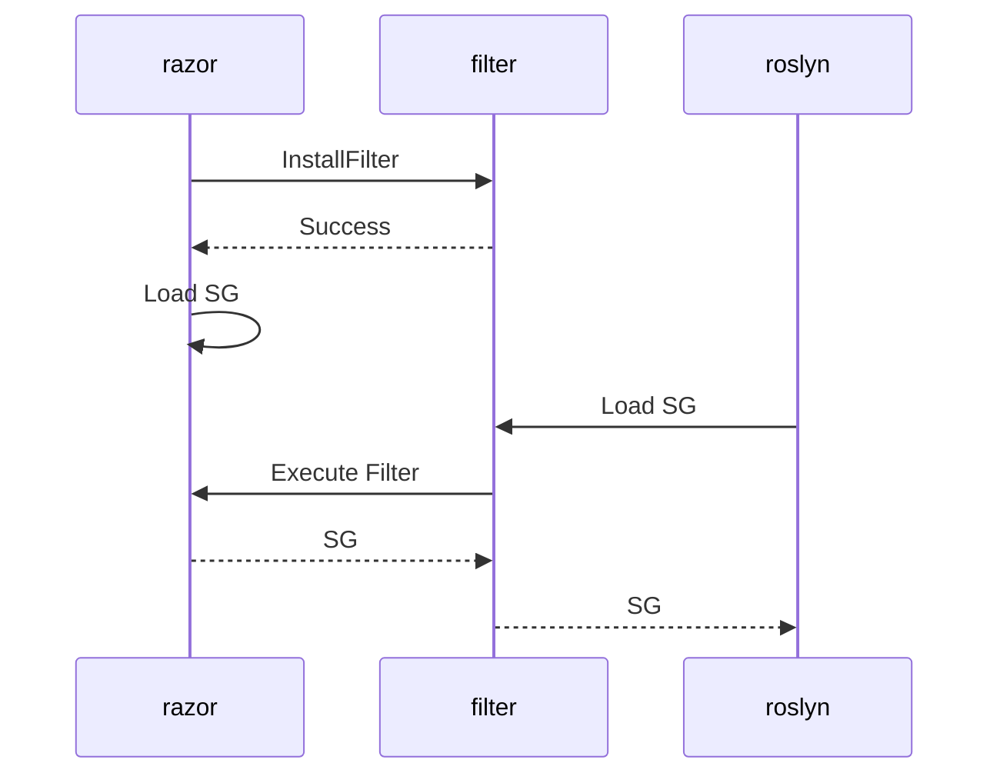
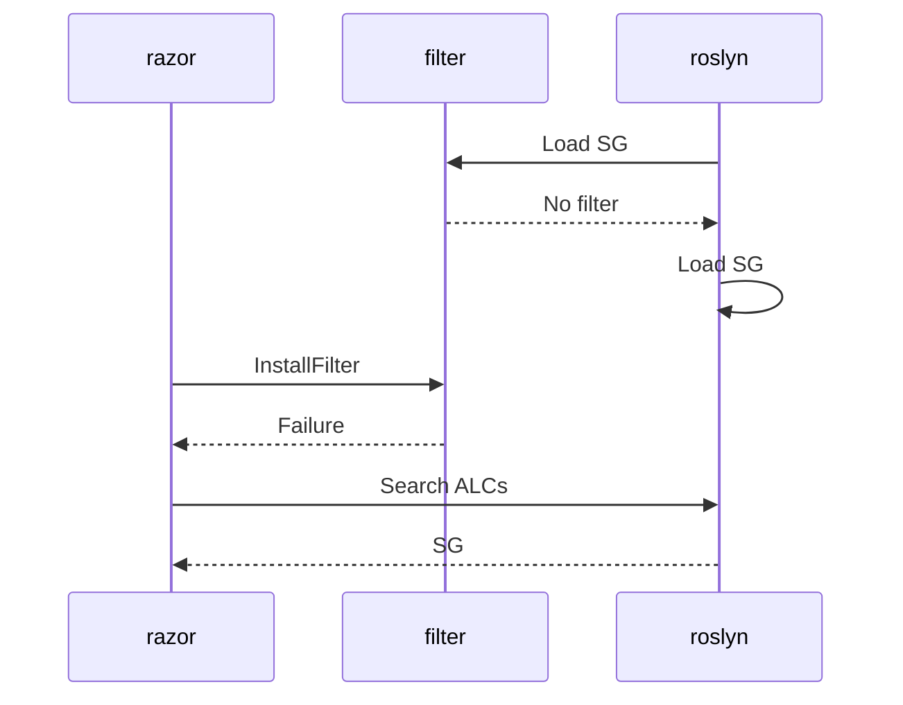
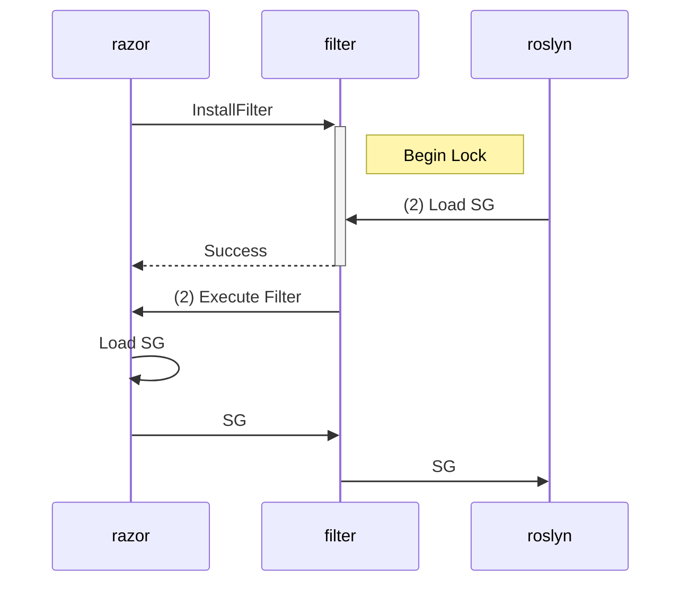
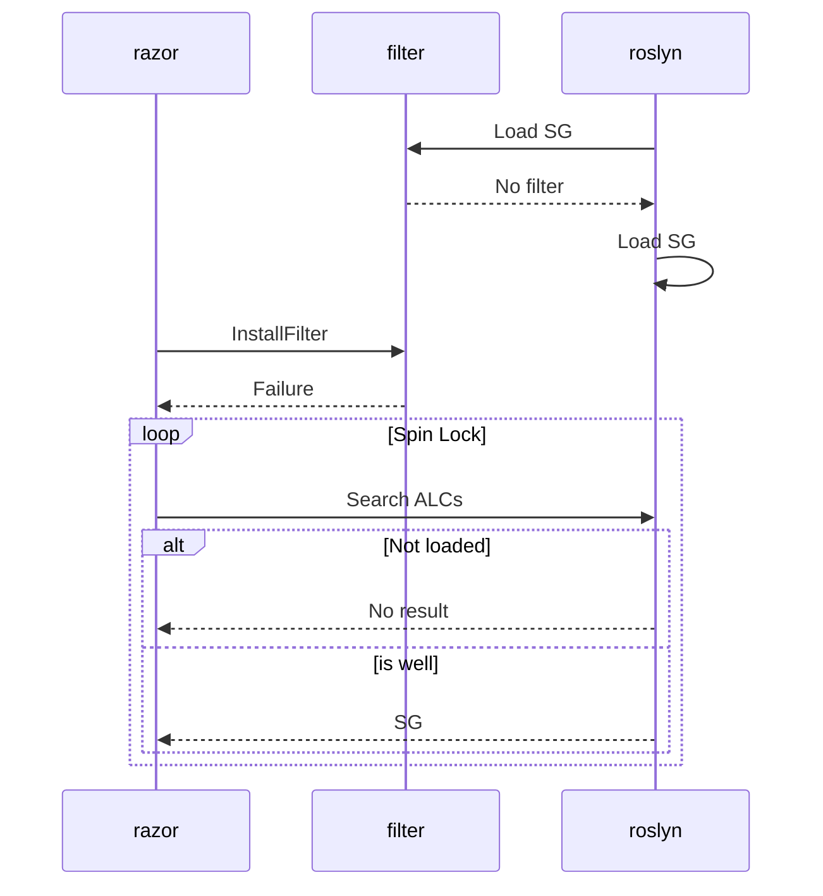
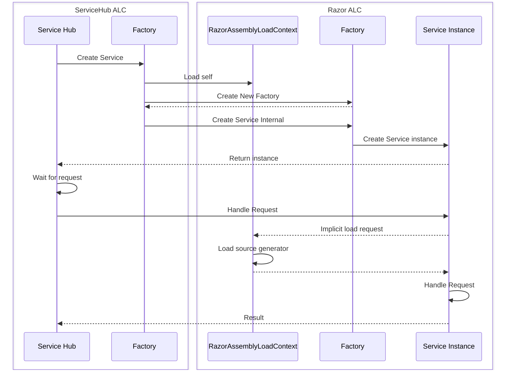

# Assembly Loading Strategy

When running in co-hosting mode it is essential that the types used by the source generator and the rest of the tooling unify; Roslyn and Razor tooling must 'share' the same loaded copy of the source generator. This requires that Roslyn and Razor co-ordinate as to who is responsible for loading the source generator, and the other party must use the already loaded copy. Unfortunately, due to asynchronous loading it is non-deterministic as to which party will first attempt to load the generator.

If Razor loads first, the generator will be automatically loaded as a dependency. Because Razor directly references Roslyn, it has the ability to set a filter on the Roslyn loading code that will intercept the load and use the version already loaded by Razor. However if Roslyn tries to load the generator *before* Razor tooling has been loaded then the filter is unset and the source generator will be loaded into the default Shadow copy Assembly Load Context (ALC) in the same way as other generators. Roslyn has no reference to Razor, so has no ability to inform Razor that it should use the already loaded instance in the Shadow copy ALC.

It is possible to enumerate the ALC instances and search for a loaded assembly but its possible that Roslyn had already started loading the assembly at the point at which Razor checks; Razor doesn't find it so installs the filter and loads it, meanwhile the Roslyn code resumes loading and loads a duplicate copy into the shadow copy ALC.

Thus it becomes clear that this problem requires a strongly synchronized approach so that we can deterministically load a single copy of the source generator.

## Approach

While we stated that Roslyn has no references to Razor, it *does* have an 'External Access' (EA) assembly available to Razor. These are generally used as ways the Roslyn team can give internal access to small areas of code to authorized third parties in a way that minimizes breakages. If we create a filter in the razor EA assembly and have it always load, we can maintain a persistent hook that can be used to synchronize between the two parties.

The hook simply records the list of assemblies that have been loaded by Roslyn. In the majority of cases, when Razor and Roslyn aren't co-hosted, this is all it does and nothing else. However it also exposes an atomic 'check-and-set' style filter installation routine. This takes a 'canary' assembly to be checked to see if it has already been loaded. If the canary has already been loaded the filter installation fails. When the canary hasn't yet been seen the filter is installed. The assembly resolution and filter installation are synchronized to ensure that it is an atomic operation.

When the filter installation succeeds Razor can continue loading its copy of the source generator, with the knowledge that any requests by Roslyn to load it will be redirected to it. As long as Razor also synchronizes its loading code with the filter requests it is possible to deterministically ensure that Roslyn will always use Razor's copy in this case. If filter installation fails then Roslyn has already loaded (or begun loading) the source generator, and so Razor must retrieve the loaded copy rather than loading its own. In the very small possibility that Roslyn has begun loading the assembly but not yet finished, Razor is required to spin-wait for the assembly to become available. It's technically possible that Roslyn will fail to load the assembly meaning it will never become available so Razor tooling must use a suitable timeout before erroring.

### Examples

The following are possible sequences of events for the load order. Note that locks aren't shown unless they impact the order of operations

Razor loads first:

Roslyn loads first

Razor loads first, roslyn tries to load during loading:

Roslyn loads first, razor tries to load during loading:

## Intercepting the ALC load for Razor tooling

In order to 'choose' which source generator assembly is used by the tooling, it needs some method to intercept the loading of the assembly and return the preferred copy. Razor tooling is hosted in ServiceHub, which has its own assembly loading mechanisms based on ALC. Unfortunately there is no way to override the loading logic of the provided ALC that can be hooked into to achieve this. Instead, Razor provides its own ALC ([RazorAssemblyLoadContext.cs](..\src\Razor\src\Microsoft.CodeAnalysis.Remote.Razor\RazorAssemblyLoadContext.cs)) that has the logic required to interact with the Roslyn EA assembly.

ServiceHub doesn't provide a way to specify a particular ALC implementation to use when loading a service, and due to the nature of ServiceHub by the time the razor tooling code is running it has already been loaded into the ServiceHub ALC. Thus Razor tooling needs a way of bootstrapping itself into the Razor specific ALC before any code runs.

This is handled in [RazorBrokeredServiceBase.FactoryBase\`1.cs](..\src\Razor\src\Microsoft.CodeAnalysis.Remote.Razor\RazorBrokeredServiceBase.FactoryBase`1.cs). When ServiceHub requests the factory create an instance of the service, the factory instead loads a copy of itself into a shared instance of the `RazorAssemblyLoadContext`, and via reflection thunks the create request to the factory there. The instance created in the Razor ALC is returned to ServiceHub. This means that any code in the returned service that causes as assembly load will be handled by the Razor ALC, allowing for interception in the case of the source generator.

### Example

