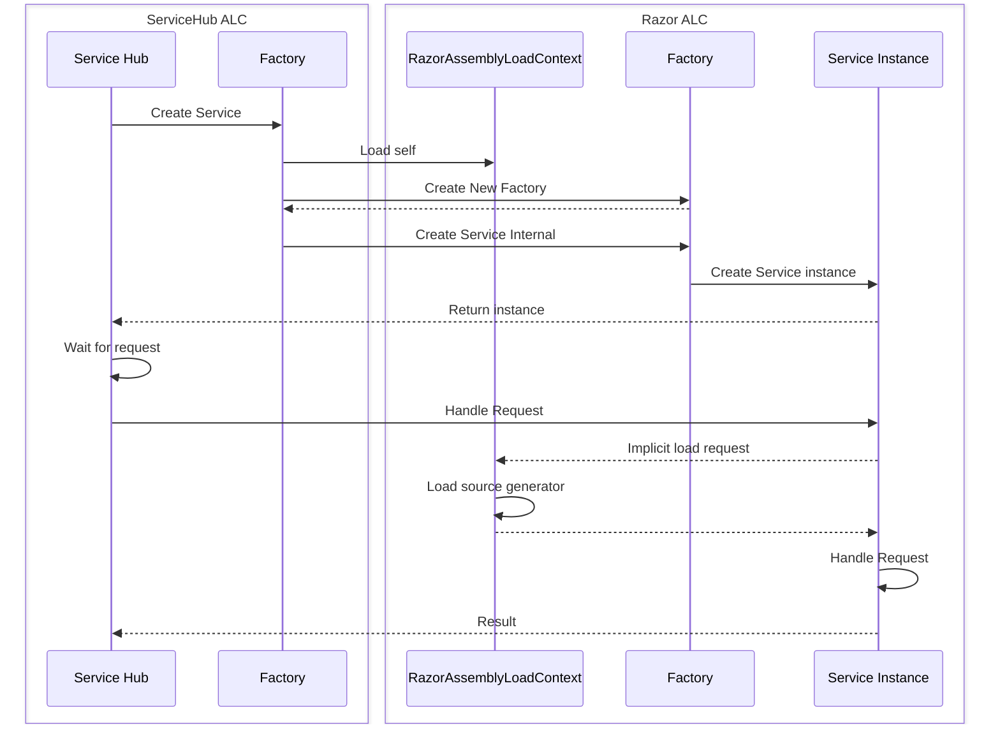

# Assembly Loading Strategy

When running in co-hosting mode it is essential that the types used by the source generator and the rest of the tooling unify; Roslyn and Razor tooling must 'share' the same loaded copy of the source generator. This requires that Roslyn and Razor co-ordinate as to who is responsible for loading the source generator, and the other party must use the already loaded copy. Unfortunately, due to asynchronous loading it is non-deterministic as to which party will first attempt to load the generator.

In order to synchronize the loading, Razor tooling always defers loading the Razor compiler to Roslyn via the ExternalAccess (EA) assembly. Roslyn will load the Razor compiler assembly, and its dependencies, into a shared ALC. If the Razor tooling accesses the generator before Roslyn has loaded it, it will first be loaded then returned. When Roslyn comes to load the generator the already existing copy will be used to ensure it remains shared.

Note that this strategy requires the Roslyn EA loader stub to know the name of the Razor compiler assembly and its dependencies. This is not ideal, but removes the need for extremely complicated synchronization code between the two processes. It is assumed that the compiler name and its dependencies wil change a small enough amount of times for this to be a fair trade off.

## Intercepting the ALC load for Razor tooling

In order to 'choose' which source generator assembly is used by the tooling, it needs some method to intercept the loading of the assembly and return the preferred copy. Razor tooling is hosted in ServiceHub, which has its own assembly loading mechanisms based on ALC. Unfortunately there is no way to override the loading logic of the provided ALC that can be hooked into to achieve this. Instead, Razor provides its own ALC ([RazorAssemblyLoadContext.cs](..\src\Razor\src\Microsoft.CodeAnalysis.Remote.Razor\RazorAssemblyLoadContext.cs)) that has the logic required to interact with the Roslyn EA assembly.

ServiceHub doesn't provide a way to specify a particular ALC implementation to use when loading a service, and due to the nature of ServiceHub by the time the razor tooling code is running it has already been loaded into the ServiceHub ALC. Thus Razor tooling needs a way of bootstrapping itself into the Razor specific ALC before any code runs.

This is handled in [RazorBrokeredServiceBase.FactoryBase\`1.cs](..\src\Razor\src\Microsoft.CodeAnalysis.Remote.Razor\RazorBrokeredServiceBase.FactoryBase`1.cs). When ServiceHub requests the factory create an instance of the service, the factory instead loads a copy of itself into a shared instance of the `RazorAssemblyLoadContext`, and via reflection thunks the create request to the factory there. The instance created in the Razor ALC is returned to ServiceHub. This means that any code in the returned service that causes as assembly load will be handled by the Razor ALC, allowing for interception in the case of the source generator.

### Example

