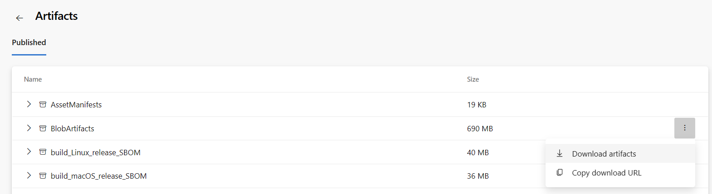
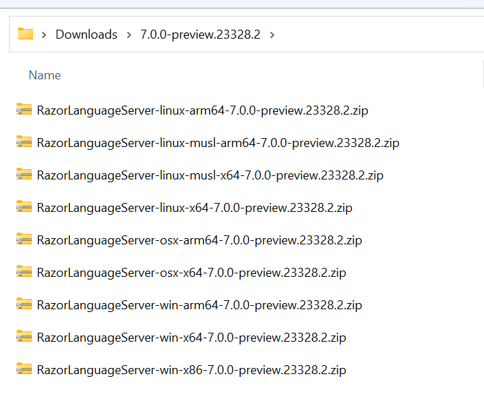

# Inserting Razor into the VS Code C# Extension

## Overview

The C# extension is the shipping vehicle for the VS Code Razor experience, so to do a "release" to VS Code, what we actually need to do is insert our bits into the [C# extension repository](https://github.com/dotnet/vscode-csharp)

At a high level inserting involves:

1. Downloading the right build artifacts from our official CI build
2. Uploading a subset of those artifacts to a special folder on a network share
3. Running a pipeline to take the folder contents and upload them to a CDN for external consumption
4. Doing a pull request to the extension repo to update various download URLs

## Permissions

Before getting started you it should be noted that only Microsoft employees will have the correct access to get the right information to perform and insertion. Details on the permissions required are outlined at this [internal document](https://github.com/dotnet/aspnetcore-internal/blob/main/docs/release/InsertingRazorIntoOmniSharp.md#get-the-permissions-youll-need-later).

## Inserting

When ready to insert you will follow the steps listed in each below section in order to update the C# extension with the latest Razor assets:

### Acquire all the pieces to insert

First you need to locally download and extract the build artifacts that you want to deploy

1. Go to the Razor build you want to insert at https://dev.azure.com/dnceng/internal/_build?definitionId=262

    - You may want to use a build that has already successfully been inserted into Visual Studio for Windows, so that we get the benefit from the various smoke tests and regression tests that are present in that process.

2. Click the "X Artifacts" link from the build information
    
3. Find the **BlobArtifacts** artifact and download it by clicking the `...` menu:
    - You won't need everything in BlobArtifacts but its much more convenient to download a single file, and you only approximately 7% of the download is unnecessary.

    
4. Unzip the BlobArtifacts.zip file you end up with and delete:
    - Any file that doesn't start with "RazorLanguageServer"
    - The file that starts with "RazorLanguageServer-PlatformAgnostic"

At the end of this process you should have a folder containing 9 files. Rename the folder to the version number, pulled from any one of the file names in the folder.



### Upload to VS CDN

1. Wait for the permissions you requested at the top of this document to be accepted.
2. Go to the server, and the `release` share, then the `\ddpublish\vscode-razor` folder
    - For the name of the server, skip to step 4, and you'll see it in the Azure DevOps UI. The actual server name is unimportant, and liable to change, as long as its the one the release pipeline linked below is looking at.
3. Upload the entire folder you created above.
    - Alternatively, create a folder named the version that you'll be publishing, i.e. `7.0.0-preview.23328.2`, and then upload each of the 9 zip files you have after the above steps.
4. Navigate to the CDN upload [Release Pipeline](https://devdiv.visualstudio.com/DevDiv/_releases2?definitionId=1025&view=mine&_a=releases) and click **Create release** in the top right corner.
    - **BranchName:** use the format `vscode-razor-{VERSION}` where `{VERSION}` is something like `7.0.0-preview.23328.2`.
    - **OwnerAliases:** Leave existing aliases, adding your alias(es) in the form `{DOMAIN}\{ALIAS}` where `{ALIAS}` is something like `REDMOND\FNURK` - semicolon delimited, including the single quotes.
    - **SecuredSharePath:** Replace `<yourPath>` with the full path of the folder you created above in Step 2 of this section.
5. Click `Create`
6. At the top of the page it should mention that `Release - X` has been created. Click on it.
7. When ready to publish, hover over the `Publish Secured Share Environment` box and click the `Deploy` button that appears.
8. You'll be prompted for a comment, but it's not necessary. Press 'Deploy'.
9. It can take anywhere from 20 mins to 11+ hours for things to deploy and propagate. A deployment completion email is **not** sent.
10. Once the "Wait For Publish Completed" stage is done view its logs.
11. Click on the `Get Published Link Relationships` log. This will have a section that contains a relationship of file -> CDN URL.

### Prepare URLs

You should now have 9 lines of text that are in the format:

```
2023-06-29T01:16:17.9746140Z release\DDPublish\vscode-razor\7.0.0-preview.23328.2\microsoft.aspnetcore.razor.vscode-7.0.0-preview.23328.2.tgz -> https://download.visualstudio.microsoft.com/download/pr/51d2bf3c-cb3c-4385-b59f-d4d6c9a96743/7651d4e99d29188466f10e64fffe4996/microsoft.aspnetcore.razor.vscode-7.0.0-preview.23328.2.tgz
2023-06-29T01:16:17.9751735Z release\DDPublish\vscode-razor\7.0.0-preview.23328.2\RazorLanguageServer-linux-arm64-7.0.0-preview.23328.2.zip -> https://download.visualstudio.microsoft.com/download/pr/51d2bf3c-cb3c-4385-b59f-d4d6c9a96743/c74964f4e130b50f9aef47d430c34a97/razorlanguageserver-linux-arm64-7.0.0-preview.23328.2.zip
2023-06-29T01:16:17.9757540Z release\DDPublish\vscode-razor\7.0.0-preview.23328.2\RazorLanguageServer-linux-musl-arm64-7.0.0-preview.23328.2.zip -> https://download.visualstudio.microsoft.com/download/pr/51d2bf3c-cb3c-4385-b59f-d4d6c9a96743/7ad5dd2c8780d3e4eaaafb5352a21afa/razorlanguageserver-linux-musl-arm64-7.0.0-preview.23328.2.zip
2023-06-29T01:16:17.9763098Z release\DDPublish\vscode-razor\7.0.0-preview.23328.2\RazorLanguageServer-linux-musl-x64-7.0.0-preview.23328.2.zip -> https://download.visualstudio.microsoft.com/download/pr/51d2bf3c-cb3c-4385-b59f-d4d6c9a96743/c204acfa0fd9d0e06fbcc3aac3ba846e/razorlanguageserver-linux-musl-x64-7.0.0-preview.23328.2.zip
2023-06-29T01:16:17.9768735Z release\DDPublish\vscode-razor\7.0.0-preview.23328.2\RazorLanguageServer-linux-x64-7.0.0-preview.23328.2.zip -> https://download.visualstudio.microsoft.com/download/pr/51d2bf3c-cb3c-4385-b59f-d4d6c9a96743/68986857aef04be58efab25ffd338a93/razorlanguageserver-linux-x64-7.0.0-preview.23328.2.zip
2023-06-29T01:16:17.9774462Z release\DDPublish\vscode-razor\7.0.0-preview.23328.2\RazorLanguageServer-osx-arm64-7.0.0-preview.23328.2.zip -> https://download.visualstudio.microsoft.com/download/pr/51d2bf3c-cb3c-4385-b59f-d4d6c9a96743/a31700a64049f7c770a525662ef74f3c/razorlanguageserver-osx-arm64-7.0.0-preview.23328.2.zip
2023-06-29T01:16:17.9780249Z release\DDPublish\vscode-razor\7.0.0-preview.23328.2\RazorLanguageServer-osx-x64-7.0.0-preview.23328.2.zip -> https://download.visualstudio.microsoft.com/download/pr/51d2bf3c-cb3c-4385-b59f-d4d6c9a96743/d7017a3e07d15f057353ab21b8710714/razorlanguageserver-osx-x64-7.0.0-preview.23328.2.zip
2023-06-29T01:16:17.9786564Z release\DDPublish\vscode-razor\7.0.0-preview.23328.2\RazorLanguageServer-PlatformAgnostic-7.0.0-preview.23328.2.zip -> https://download.visualstudio.microsoft.com/download/pr/51d2bf3c-cb3c-4385-b59f-d4d6c9a96743/fca9e77ad09cc54b115bfb8b5e6aaf66/razorlanguageserver-platformagnostic-7.0.0-preview.23328.2.zip
2023-06-29T01:16:17.9792213Z release\DDPublish\vscode-razor\7.0.0-preview.23328.2\RazorLanguageServer-win-arm64-7.0.0-preview.23328.2.zip -> https://download.visualstudio.microsoft.com/download/pr/51d2bf3c-cb3c-4385-b59f-d4d6c9a96743/b2aa92ccbdf03761b6783bf123bfbe22/razorlanguageserver-win-arm64-7.0.0-preview.23328.2.zip
2023-06-29T01:16:17.9797904Z release\DDPublish\vscode-razor\7.0.0-preview.23328.2\RazorLanguageServer-win-x64-7.0.0-preview.23328.2.zip -> https://download.visualstudio.microsoft.com/download/pr/51d2bf3c-cb3c-4385-b59f-d4d6c9a96743/3b7fc7c2f06e48d78bec2125adcc41aa/razorlanguageserver-win-x64-7.0.0-preview.23328.2.zip
2023-06-29T01:16:17.9803596Z release\DDPublish\vscode-razor\7.0.0-preview.23328.2\RazorLanguageServer-win-x86-7.0.0-preview.23328.2.zip -> https://download.visualstudio.microsoft.com/download/pr/51d2bf3c-cb3c-4385-b59f-d4d6c9a96743/d1b37bd821529147e7ffec08f98be17c/razorlanguageserver-win-x86-7.0.0-preview.23328.2.zip
```

You need to put that in your text editor of choice, remove everything but the `https://` URLs, add a comma to the end of every line, then collapse the whole thing down to one line. ie:

`https://download.visualstudio.microsoft.com/&lt;snip%gt;razorlanguageserver-win-x86.zip,https://download.visualstudio.microsoft.com/&lt;snip%gt;razorlanguageserver-win-x64.zip`

### Update vscode-csharp

1. Fork the [C# extension repo](https://github.com/dotnet/vscode-csharp) and then clone your fork.
    - If you already have the repo cloned, ensure that you `git clean -xdf` prior to doing any changes.
2. Create a new branch off of `main` unless told otherwise.
3. Open the `launch.json` file.
4. Find the "Update razor package dependencies" task.
5. Paste your list of URLs into the `NEW_DEPS_URLS` environment variable
6. Paste the version of the packages into the `NEW_DEPS_VERSION` environment variable
7. Run the task
8. It takes a while to run, as it has to download and compute hashes for each file, but when finished it will have changed the package.json file.
9. Commit both files, push your branch, and create a PR.

### Optional additional changes

If there were changes to the Razor grammar you'll need to update that as well. In the `vscode-csharp` repo you can do that by updating the `src/razor/syntaxes/aspnetcorerazor.tmLanguage.json` file, copying across the one from this repo.

## Testing

To validate your changes locally, after updating the package.json, make sure you run `gulp installDependencies`, and then run the "Launch Extension" task.
