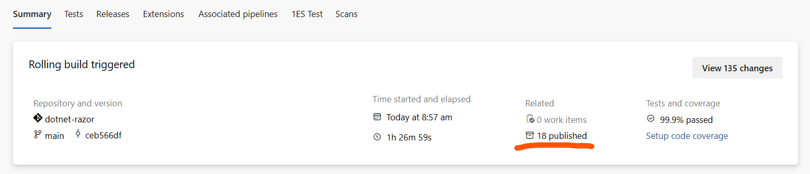

# Inserting Razor into the VS Code C# Extension

## Overview

The C# extension is the shipping vehicle for the VS Code Razor experience, so to do a "release" to VS Code, what we actually need to do is insert our bits into the [C# extension repository](https://github.com/dotnet/vscode-csharp)

At a high level inserting involves:

1. Find the version number from CI builds
2. Updating the vscode repo and doing a PR by
    1. Update the version in the `package.json`
    2. Running `updateRazorVersion` via gulp
    3. Pushing a PR

## Permissions

In order to pull in new packages from upstreams into the msft_consumption feed we use for restoring, you will need to be a member of the 'CSharp VS Code Extension contributors' group in the [Azure Devops instance](https://dev.azure.com/azure-public/vside/_settings/teams). This is the same as needed to [update the Roslyn language server version](https://github.com/dotnet/vscode-csharp/blob/main/CONTRIBUTING.md#updating-the-roslyn-language-server-version).

## Inserting

When ready to insert you will follow the steps listed in each below section in order to update the C# extension with the latest Razor assets:

### Find the version to insert

1. Go to the Razor build you want to insert at https://dev.azure.com/dnceng/internal/_build?definitionId=262

    - You may want to use a build that has already successfully been inserted into Visual Studio for Windows, so that we get the benefit from the various smoke tests and regression tests that are present in that process.

2. Click the "X Artifacts" link from the build information
    
3. Find the **BlobArtifacts** artifact
    
4. Get the version from any nupkg, such as `9.0.0-preview.24311'. They should all be the same version number

### Update vscode-csharp

1. Fork the [C# extension repo](https://github.com/dotnet/vscode-csharp) and then clone your fork.
    - If you already have the repo cloned, ensure that you `git clean -xdf` prior to doing any changes.
2. Create a new branch off of `main` unless told otherwise.
3. Open the `package.json` file.
4. Find the "defaults.razor" property.
5. Update the value of that property to the version you found in the CI build
6. Run `npm i' to install tools needed locally
7. Run `npx gulp updateRazorVersion` to download the nuget packages for all platforms and make sure they are available in the downstream nuget feed.
    - This is the step that will fail if you do not have the correct dependencies. Likely you'll get a 401 from the nuget command trying to pull the packages from upstream.
8. Update `CHANGELOG.md` with the changes from these updates.
9. Commit all files, push your branch, and create a PR.

## Testing

To validate your changes locally, after updating the package.json, make sure you run `npx gulp installDependencies`, and then run the "Launch Extension" task.
