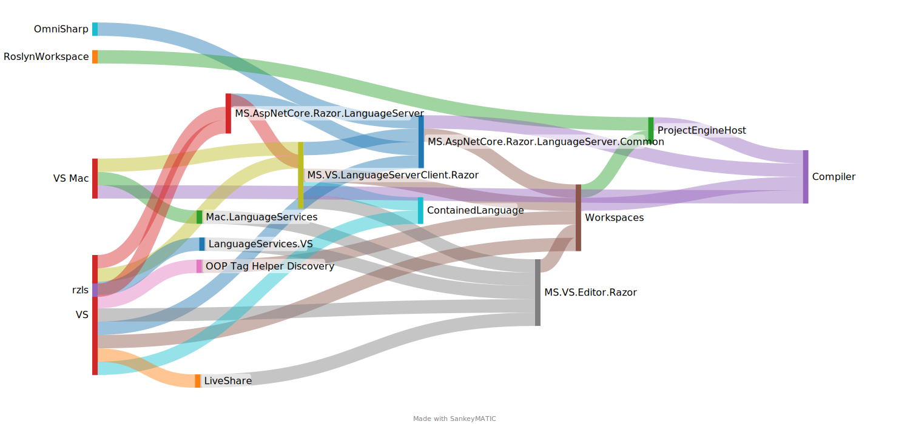

# Product Layers

## High Level Overview



<details>
Created with https://www.sankeymatic.com/build/

Input:
```
RoslynWorkspace [1] ProjectEngineHost
MS.AspNetCore.Razor.LanguageServer [1] MS.AspNetCore.Razor.LanguageServer.Common
MS.AspNetCore.Razor.LanguageServer.Common [1] Compiler
MS.AspNetCore.Razor.LanguageServer.Common [1] Workspaces
ProjectEngineHost [1] Compiler
Workspaces [1] Compiler
Workspaces [1] ProjectEngineHost
OOP Tag Helper Discovery [1] Workspaces
MS.VS.Editor.Razor [1] Workspaces
MS.VS.LanguageServerClient.Razor [1] MS.AspNetCore.Razor.LanguageServer
MS.VS.LanguageServerClient.Razor [1] MS.AspNetCore.Razor.LanguageServer.Common
MS.VS.LanguageServerClient.Razor [1] Workspaces
MS.VS.LanguageServerClient.Razor [1] MS.VS.Editor.Razor
MS.VS.LanguageServerClient.Razor [1] ContainedLanguage
LanguageServices.VS [1] MS.VS.Editor.Razor
LiveShare [1] MS.VS.Editor.Razor
Mac.LanguageServices [1] MS.VS.Editor.Razor
VS Mac [1] Compiler
VS Mac [1] MS.VS.LanguageServerClient.Razor
VS Mac [1] Mac.LanguageServices
VS [1] MS.AspNetCore.Razor.LanguageServer
VS [1] MS.AspNetCore.Razor.LanguageServer.Common
VS [1] Workspaces
VS [1] OOP Tag Helper Discovery
VS [1] MS.VS.Editor.Razor
VS [1] ContainedLanguage
VS [1] MS.VS.LanguageServerClient.Razor
VS [1] LanguageServices.VS
VS [1] LiveShare
rzls [1] MS.AspNetCore.Razor.LanguageServer
```
</details>

## Details

### Shared

This project is shared between all layers (both compiler and tooling) to provide language support types for modern C# language features.

- Target Framework: `net8.0;netstandard2.0;net472`
- Projects:
  - Microsoft.AspNetCore.Razor.Utilities.Shared

### Compiler

- Target Framework: `net8.0;netstandard2.0`
- Projects:
  - Microsoft.CodeAnalysis.Razor.Compiler

### Tooling Core

These projects are referenced by most Razor tooling projects. Because of this, they
target the broadest set of frameworks.

- Target Framework: `net8.0;netstandard2.0;net472`
- Projects:
  - Microsoft.AspNetCore.Razor.ProjectEngineHost
  - Microsoft.CodeAnalysis.Razor.Workspaces

### Razor Language Server

- Target Framework: `net8.0;net472`
- Projects:
  - Microsoft.AspNetCore.Razor.LanguageServer
  - Microsoft.AspNetCore.Razor.LanguageServer.Common
  - Microsoft.AspNetCore.Razor.LanguageServer.Protocol

### Razor Language Server (rzls)

- Target Framework: `net9.0`
- Projects:
  - rzls

### Roslyn OOP (for Visual Studio)

- Target Framework: `netstandard2.0`
- Projects:
  - Microsoft.CodeAnalysis.Remote.Razor
  - Microsoft.CodeAnalysis.Remote.Razor.CoreComponents

### Visual Studio (Windows)

- Target Framework: `net472`
- Projects:
  - Microsoft.VisualStudio.Editor.Razor
  - Microsoft.VisualStudio.LanguageServer.ContainedLanguage
  - Microsoft.VisualStudio.LanguageServerClient.Razor
  - Microsoft.VisualStudio.LiveShare.Razor
  - Microsoft.VisualStudio.RazorExtension
  - Microsoft.VisualStudio.RazorExtension.Dependencies
  - RazorDeployment

### RazorExtension for Roslyn Language Server in VS Code

- Target Framework: net9.0
- Projects:
  - Microsoft.VisualStudioCode.RazorExtension

## Testing Layers

### Shared test infra

- Microsoft.AspNetCore.Razor.Test.Common (`net8.0`;`net472`)

### API Shims

- Microsoft.AspNetCore.Razor.Test.ComponentShim (`netstandard2.0`)
- Microsoft.AspNetCore.Razor.Test.MvcShim (`net8.0`;`net472`)
- Microsoft.AspNetCore.Razor.Test.MvcShim.ClassLib (`netstandard2.0`)
- Microsoft.AspNetCore.Razor.Test.MvcShim.Version1_X (`net8.0`;`net472`)
- Microsoft.AspNetCore.Razor.Test.MvcShim.Version2_X (`net8.0`;`net472`)

### Tooling Core Tests

- Microsoft.CodeAnalysis.Razor.Workspaces.Test (`net8.0`;`net472` - only on Windows)
- Microsoft.CodeAnalysis.Razor.Workspaces.Test.Common (`net8.0`;`net472`)

### Language Server

- Microsoft.AspNetCore.Razor.LanguageServer.Common.Test (`net8.0`)
- Microsoft.AspNetCore.Razor.LanguageServer.Test (`net8.0-windows`)
- Microsoft.AspNetCore.Razor.LanguageServer.Test.Common (`net8.0`;`net472`)

### Roslyn OOP (for Visual Studio) Tests

- Microsoft.CodeAnalysis.Remote.Razor.Test (`net8.0`;`net472` - only on Windows)

### Visual Studio Code (Windows)

- Microsoft.VisualStudio.Editor.Razor.Test (`net472`)
- Microsoft.VisualStudio.Editor.Razor.Test.Common (`net472`)
- Microsoft.VisualStudio.LanguageServer.ContainedLanguage.Test (`net472`)
- Microsoft.VisualStudio.LanguageServer.ContainedLanguage.Test.Common (`net472`)
- Microsoft.VisualStudio.LanguageServerClient.Razor.Test (`net472`)
- Microsoft.VisualStudio.LanguageServices.Razor.Test (`net472`)
- Microsoft.VisualStudio.LiveShare.Razor.Test (`net472`)
- Microsoft.VisualStudio.Razor.IntegrationTests (`net472`)
